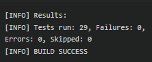
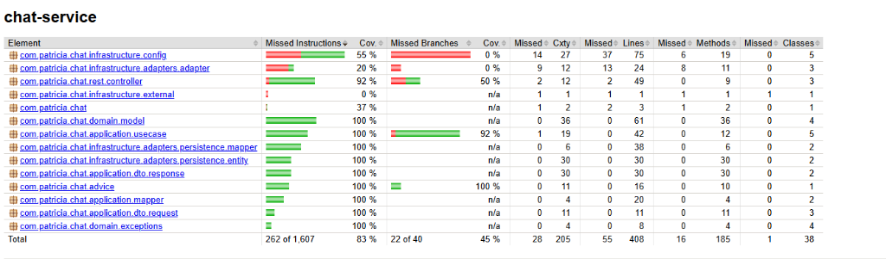
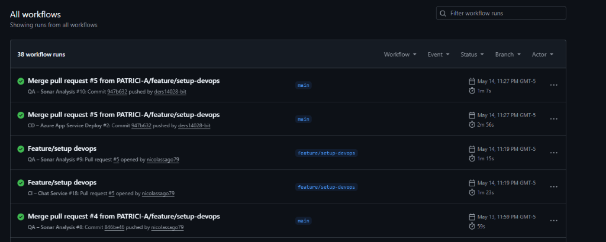

<div align="center">

# 💬 PATRICI.A — Microservicio de Chat y Conexiones


> 💡 **PATRICI.A** es un proyecto académico de la Escuela Colombiana de Ingeniería Julio Garavito, construido con arquitectura de microservicios orientada a producción.

</div>

---

## 📑 Tabla de Contenidos

1. [👤 Integrantes](#1--integrantes)
2. [⚙️ Tecnologías Utilizadas](#2--tecnologías-utilizadas)
3. [🎯 Descripción del Módulo](#3--descripción-del-módulo)
4. [🏗️ Cómo Funciona el Módulo](#4--cómo-funciona-el-módulo)
5. [📊 Diagramas](#5--diagramas)
   - [5.1 Diagrama de Datos](#51-diagrama-de-datos--modelo-mongodb)
   - [5.2 Diagrama de Clases](#52-diagrama-de-clases)
   - [5.3 Diagrama de Componentes](#53-diagrama-de-componentes)
6. [🧩 Funcionalidades](#6--funcionalidades)
   - [RF07 — Gestión de Conexiones](#rf07--gestión-de-conexiones)
   - [RF10 — Chat en Tiempo Real](#rf10--chat-en-tiempo-real)
7. [🧪 Evidencia de Pruebas Unitarias](#7--evidencia-de-pruebas-unitarias)
8. [📈 Evidencia de Cobertura](#8--evidencia-del-análisis-de-cobertura)
9. [🚀 Cómo Ejecutar el Proyecto](#9--cómo-ejecutar-el-proyecto)
10. [🔄 Evidencia CI/CD](#10--evidencia-del-despliegue-cicd)
11. [🌐 Link Expuesto en Azure/AWS con Swagger](#11--link-expuesto-en-azureaws-con-swagger)
12. [🗂️ Organización del Código](#12--organización-del-código)
13. [📝 Código Documentado](#13--código-documentado)
14. [🔗 Conexiones con Servicios Externos](#14--conexiones-con-servicios-externos)
15. [⚙️ Pipeline de Desarrollo](#15--pipeline-de-desarrollo)
16. [🚢 Pipeline de PROD](#16--pipeline-de-prod)

---

## 1. 👤 Integrantes

| Nombre | correo                                     |
|---|--------------------------------------------|
| Cristian Guerrero | cristian.guerrero-b@mail.escuelaing.edu.co |
| Santiago Cajamarca | david.cajamarca-c@mail.escuelaing.edu.co   |
| Nicolas Sanchez | nicolas.sanchez-g@mail.escuelaing.edu.co   |
| Daniel Rodriguez | daniel.rsuarez@mail.escuelaing.edu.co      |

El equipo **Squirtle Squad** aplicó la metodología **Scrum** con sprints semanales, usando **Jira** para seguimiento de tareas y **GitHub Projects** como tablero de trabajo.

---

## 2. ⚙️ Tecnologías Utilizadas

| Categoría | Tecnología / Herramienta | Versión | Uso Principal |
|---|---|---|---|
| **Lenguaje** |  | 21 | Lógica de negocio y servicios |
| **Framework** |  | 3.3.0 | Núcleo del microservicio |
| **Seguridad** |  | - | Autenticación JWT y Filtros |
| **Comunicación** |  | - | Chat en tiempo real |
| **Persistencia** |  | Cloud | Mensajes y Conexiones |
| **API Doc** |  | 2.5.0 | Documentación interactiva |
| **Calidad** |  | 0.8.11 | Cobertura de pruebas |
| **DevOps** |  | - | Contenedorización |

---

## 3. 🎯 Descripción del Módulo

El **Chat Service** es el microservicio de PATRICI.A encargado de gestionar la comunicación directa entre estudiantes. Cubre dos responsabilidades principales: la **mensajería instantánea dentro de los parches** y la **gestión de conexiones de amistad** entre usuarios de la plataforma.

El servicio provee un canal de comunicación en tiempo real mediante WebSockets, permitiendo que los miembros de un parche intercambien mensajes de texto y multimedia de forma instantánea. Adicionalmente, expone endpoints REST para la consulta paginada del historial de mensajes y el control del estado de conexión entre usuarios (enviar, aceptar, rechazar y listar solicitudes de amistad).

El acceso al canal de chat de cada parche está restringido exclusivamente a sus miembros activos. La verificación de membresía se realiza mediante integración con el **Parche Service** a través de Feign Client, y toda solicitud es autenticada contra el **Auth Service** mediante JWT.

### Funcionalidades Principales

| 💡 Funcionalidad | Descripción |
|---|---|
| **Chat en Tiempo Real (RF10)** | Mensajería instantánea dentro de cada parche con soporte para texto mediante WebSocket STOMP. |
| **Gestión de Conexiones (RF07)** | Enviar, aceptar, rechazar y listar solicitudes de amistad entre usuarios. |
| **Historial de Mensajes** | Consulta paginada del historial de mensajes de los parches. |
| **Verificación de Membresía** | Integración con el Parche Service para validar el acceso a los chats de grupo. |

---

## 4. 🏗️ Cómo Funciona el Módulo

### Modelo Orientado a Tiempo Real y REST

El servicio opera de dos formas principales:
- **Comunicación Sincrónica (REST)**: Para gestión de estado, como enviar solicitudes de amistad, listar conexiones y consultar el historial de mensajes de un parche.
- **Comunicación Bidireccional (WebSocket)**: Para la emisión y recepción de mensajes de chat en vivo entre los usuarios dentro de un parche.

### Módulos con los que se integra

| Módulo Productor | Tipo de Integración | Propósito |
|---|---|---|
| **Auth Service** | JWT Validation | Autenticación de usuarios para acceso a endpoints y WebSockets. |
| **Parche Service** | OpenFeign (sincrónico) | Verificación de membresía antes de permitir enviar/recibir mensajes en un parche. |

### Patrones Utilizados

| Patrón | Descripción |
|---|---|
| **Ports & Adapters (Hexagonal)** | El dominio define interfaces (puertos); la infraestructura provee implementaciones (adaptadores) |
| **Repository Pattern** | Abstracción de persistencia mediante interfaces de repositorio en el dominio |
| **DTO Pattern** | Objetos de transferencia de datos para desacoplar la API del dominio interno |

---

## 5. 📊 Diagramas

### 5.1 Diagrama de Datos — Modelo MongoDB


#### Colección `messages`

| Campo | Tipo | Descripción |
|---|---|---|
| _id | ObjectId | ID generado por MongoDB |
| parcheId | String | ID del parche donde se envió el mensaje |
| senderId | String | Usuario que envía el mensaje |
| content | String | Contenido del mensaje |
| timestamp | DateTime | Fecha de envío |

#### Colección `connections`

| Campo | Tipo | Descripción |
|---|---|---|
| _id | ObjectId | ID generado |
| requesterId | String | Usuario que solicita la conexión |
| receiverId | String | Usuario que recibe la solicitud |
| status | Enum | PENDING, ACCEPTED, REJECTED |
| createdAt | DateTime | Fecha de creación de la solicitud |
| updatedAt | DateTime | Fecha de última actualización |

---

### 5.2 Diagrama de Clases


---

### 5.3 Diagrama de Componentes


---

## 6. 🧩 Funcionalidades

### RF07 — Gestión de Conexiones

Este requerimiento gestiona el ciclo de vida de las amistades entre usuarios. Consta de diferentes flujos, documentados a continuación.

#### 1. Enviar Solicitud de Conexión


##### `POST /api/connections/request`

Envía una solicitud de amistad a otro usuario.

| Campo | Tipo | Descripción |
|---|---|---|
| receiverId | String | ID del usuario a conectar |

**Response `201`:**
Retorna el objeto conexión en estado `PENDING`.

---

#### 2. Responder Solicitud


##### `PATCH /api/connections/{connectionId}`

Acepta o rechaza una solicitud.

| Campo | Tipo | Descripción |
|---|---|---|
| status | String | `ACCEPTED` o `REJECTED` |

**Response `200`:**
Retorna la conexión con el estado actualizado.

---

#### 3. Consultar Conexiones


##### `GET /api/connections`

Lista las conexiones del usuario actual.

---

### RF10 — Chat en Tiempo Real

#### WebSocket (STOMP)

##### `CONNECT /ws/chat`
Establece la conexión de WebSocket para un usuario autenticado.

##### `SEND /app/parches/{parcheId}/messages`
Envía un nuevo mensaje al parche.
- **Payload:** `{ content: "Hola a todos" }`

##### **Broadcast** `/topic/parches/{parcheId}`
Todos los usuarios suscritos al tópico reciben el mensaje enviado.

#### Historial REST

##### `GET /api/parches/{parcheId}/messages`
Recupera el historial de un parche paginado.
- **Query Params:** `page`, `size`

---

## 7. 🧪 Evidencia de Pruebas Unitarias

### Tipos de pruebas implementadas

| Tipo | Descripción | Herramientas |
|---|---|---|
| **Pruebas Unitarias** | Validan el funcionamiento aislado de cada caso de uso mockeando puertos y dependencias | JUnit 5 + Mockito |

### Cómo ejecutar las pruebas

```bash
# Ejecutar todas las pruebas
mvn clean test
```



---

## 8. 📈 Evidencia del Análisis de Cobertura

Las métricas de cobertura se generan con **JaCoCo**.

```bash
# Generar reporte de cobertura JaCoCo
mvn clean test jacoco:report
```



---

## 9. 🚀 Cómo Ejecutar el Proyecto

### Opción 1: Ejecución Local (Maven)

```bash
# 1. Clonar repositorio
git clone <URL_DEL_REPO>
cd squirtle-squad-chat-service

# 2. Levantar dependencias (MongoDB, RabbitMQ, etc si aplica)
docker-compose up -d

# 3. Ejecutar la aplicación
mvn spring-boot:run
```

📍 **URL Local:** `http://localhost:8082`

### Opción 2: Docker Compose
```bash
docker-compose up -d --build
```

### Variables de Entorno

| Variable | Descripción | Default |
|---|---|---|
| `SPRING_DATA_MONGODB_URI` | URI de conexión a MongoDB Atlas | Configurado en `application.properties` |
| `JWT_SECRET` | Clave secreta para validación de tokens | `patricia-super-secret-key...` |
| `PARCHE_SERVICE_URL` | URL base del microservicio de Parches | `http://localhost:8083` |
| `AUTH_SERVICE_URL` | URL base del microservicio de Auth | `http://localhost:9090` |
| `SERVER_PORT` | Puerto del servicio | `8084` |

---

## 10. 🔄 Evidencia CI/CD

El proyecto cuenta con pipelines de **GitHub Actions** que se ejecutan automáticamente en cada push y pull request a ramas protegidas.

**Estado actual de los Pipelines:**
[](https://github.com/PATRICI-A/squirtle-squad-chat-service/actions/workflows/ci.yml)
[](https://github.com/PATRICI-A/squirtle-squad-chat-service/actions/workflows/sonar.yml)
[](https://github.com/PATRICI-A/squirtle-squad-chat-service/actions/workflows/cd-azure.yml)

**Historial de Ejecución:**


---

## 11. 🌐 Link Expuesto en Azure/AWS con Swagger

- **API Base URL:** `https://app-patricia-chat-hagjdqg3axcweqbw.canadacentral-01.azurewebsites.net`
- **Swagger UI:** `https://app-patricia-chat-hagjdqg3axcweqbw.canadacentral-01.azurewebsites.net/swagger-ui/index.html`

---

## 12. 🗂️ Organización del Código

El microservicio sigue **Arquitectura Hexagonal (Ports & Adapters)** con Clean Architecture.

```
squirtle-squad-chat-service/
│
├── 📁 src/
│   ├── 📁 main/
│   │   ├── 📁 java/com/patricia/chat/
│   │   │   │
│   │   │   ├── 📁 domain/                          # 🟢 DOMINIO (sin dependencias externas)
│   │   │   │   ├── 📁 model/                       # Entidades: Connection, Message, Parche
│   │   │   │   ├── 📁 ports/
│   │   │   │   │   ├── 📁 in/                      # Interfaces de casos de uso (puertos de entrada)
│   │   │   │   │   └── 📁 out/                     # Interfaces de repositorios y entrega (puertos de salida)
│   │   │   │   └── 📁 exceptions/                  # Excepciones de dominio
│   │   │   │
│   │   │   ├── 📁 application/                     # 🔵 APLICACIÓN
│   │   │   │   ├── 📁 usecase/                     # Implementaciones de los casos de uso
│   │   │   │   ├── 📁 dto/
│   │   │   │   │   ├── 📁 request/                 # DTOs de entrada
│   │   │   │   │   └── 📁 response/                # DTOs de salida
│   │   │   │   └── 📁 mapper/                      # Mappers de dominio
│   │   │   │
│   │   │   ├── 📁 rest/                            # 🟠 PUERTOS DE ENTRADA (REST)
│   │   │   │   └── 📁 controller/                  # ConnectionController, MessageController, ChatWebSocketController
│   │   │   │
│   │   │   ├── 📁 advice/                          # 🟠 MANEJO DE ERRORES
│   │   │   │   └── GlobalExceptionHandler
│   │   │   │
│   │   │   └── 📁 infrastructure/                  # 🔴 INFRAESTRUCTURA
│   │   │       ├── 📁 adapters/
│   │   │       │   └── 📁 persistence/             # Documentos MongoDB, mappers de persistencia, repositorios Spring Data
│   │   │       ├── 📁 config/                      # WebSocketConfig, MongoConfig, SecurityConfig, OpenApiConfig
│   │   │       └── 📁 external/                    # Clientes Feign para otros microservicios (ParcheService)
│   │   │
│   │   └── 📁 resources/
│   │       └── application.properties
│   │
│   └── 📁 test/                                    # 🧪 PRUEBAS UNITARIAS
│
├── 📄 Dockerfile
├── 📄 docker-compose.yml
├── 📄 pom.xml
└── 📄 README.md
```

---

## 13. 📝 Código Documentado

Todo el código del microservicio está documentado con **JavaDoc en inglés**, incluyendo:

- **Dominio:** Entidades, excepciones, puertos de entrada y salida
- **Aplicación:** Interfaces e implementaciones de casos de uso, DTOs (con `@Schema` Swagger), mappers
- **Entrypoints:** Controladores REST (con `@Tag`, `@Operation`, `@ApiResponse`), exception handler
- **Infraestructura:** Adaptadores, documentos MongoDB, mappers de persistencia, todas las clases de configuración

Las anotaciones Swagger (`@Tag`, `@Operation`, `@ApiResponse`, `@Schema`) están accesibles desde la URL del Swagger UI.

---

## 14. 🔗 Conexiones con Servicios Externos

| Servicio Externo | Tipo de Conexión | Propósito |
|---|---|---|
| **MongoDB Atlas** | Spring Data MongoDB | Persistencia de mensajes de chat y conexiones de usuarios |
| **Parche Service** | OpenFeign (HTTP sincrónico) | Verificación de membresía antes de permitir interactuar en el chat |
| **Auth Service** | Verificación de JWT local | Validación de tokens de autenticación para acceso a endpoints |

### Configuración requerida

Todas las credenciales se inyectan mediante variables de entorno (MongoDB URI, JWT secret). No hay valores sensibles hardcodeados en el código.

---

## 15. ⚙️ Pipeline de Desarrollo

El pipeline de desarrollo se ejecuta en **GitHub Actions** al hacer push a ramas `feature/*` o PR hacia `develop` o `main`.

### Estrategia de Ramas (Git Flow)

| Rama | Propósito | Reglas |
|---|---|---|
| `main` | Versión estable lista para demo/producción | Solo recibe merges desde ramas de feature una vez finalizadas. PR obligatorio con aprobaciones y CI en verde. |
| `feature/*` | Desarrollo de una funcionalidad específica | Base: `main` o `develop`. Cierre: PR hacia `main`. |

### Convenciones de Ramas

```
feature/[NombreFuncionalidad]

Ejemplos:
  feature/setup-devops
  feature/ChatWebSocket
```

### Convenciones de Commits

```
Feat: [Descripción de la acción realizada]

Ejemplos:
  Feat: Configuracion WebSocket
  Feat: Correcion de Seguridad
  Feat: Despliegue en Azure
```

### Etapas del Pipeline de Desarrollo

El flujo de Integración Continua (CI) ejecuta:
- Checkout del código
- Setup Java 21
- Ejecución de pruebas unitarias con Maven (`mvn clean test`)
- Validación de despliegue Docker
- Análisis de calidad y seguridad con SonarCloud

---

## 16. 🚢 Pipeline de PROD

El pipeline de producción se activa al hacer push o merge a `main`.

### Etapas del Pipeline de PROD

El flujo de Despliegue Continuo (CD) en Azure ejecuta:
- Checkout del código
- Setup Java 21
- Compilación del JAR (`mvn clean package -DskipTests`)
- Despliegue automatizado a **Azure Web App** utilizando credenciales seguras (Service Principal)
- Health check implícito al exponer el servicio

---

<div align="center">

### 🐢 Equipo **Squirtle Squad**


**🎓 Escuela Colombiana de Ingeniería Julio Garavito**

</div>