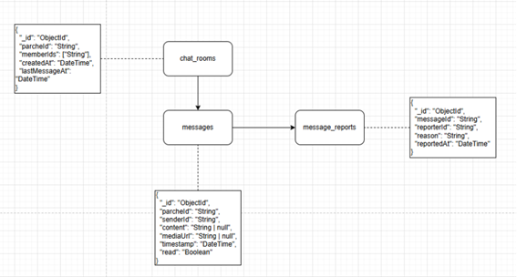
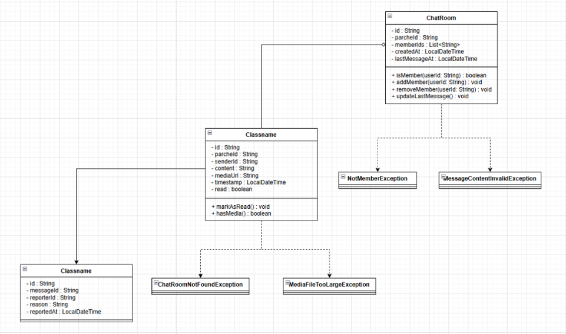
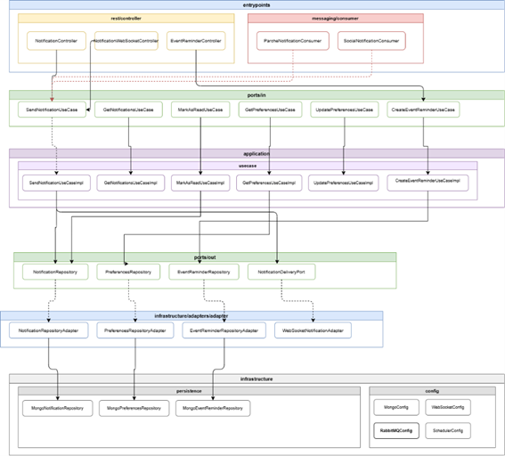
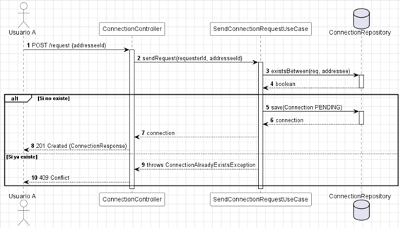
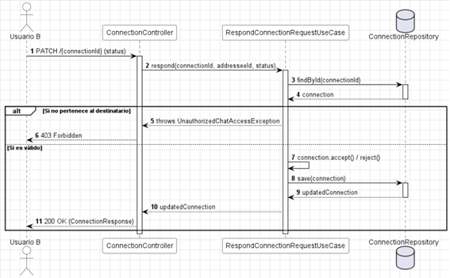
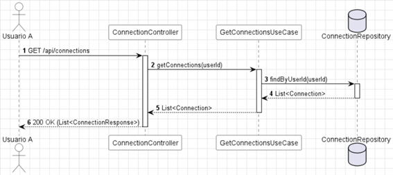

<div align="center">

# 💬 PATRICI.A — Microservicio de Chat y Conexiones


> 💡 **PATRICI.A** es un proyecto académico de la Escuela Colombiana de Ingeniería Julio Garavito, construido con arquitectura de microservicios orientada a producción.

</div>

---

## 📑 Tabla de Contenidos

1. [👤 Integrantes](#1--integrantes)
2. [⚙️ Tecnologías Utilizadas](#2--tecnologías-utilizadas)
3. [🎯 Descripción del Módulo](#3--descripción-del-módulo)
4. [🏗️ Cómo Funciona el Módulo](#4--cómo-funciona-el-módulo)
5. [📊 Diagramas](#5--diagramas)
   - [5.1 Diagrama de Datos](#51-diagrama-de-datos--modelo-mongodb)
   - [5.2 Diagrama de Clases](#52-diagrama-de-clases)
   - [5.3 Diagrama de Componentes](#53-diagrama-de-componentes)
6. [🧩 Funcionalidades](#6--funcionalidades)
   - [RF07 — Gestión de Conexiones](#rf07--gestión-de-conexiones)
   - [RF10 — Chat en Tiempo Real](#rf10--chat-en-tiempo-real)
7. [🧪 Evidencia de Pruebas Unitarias](#7--evidencia-de-pruebas-unitarias)
8. [📈 Evidencia de Cobertura](#8--evidencia-del-análisis-de-cobertura)
9. [🚀 Cómo Ejecutar el Proyecto](#9--cómo-ejecutar-el-proyecto)
10. [🔄 Evidencia CI/CD](#10--evidencia-del-despliegue-cicd)
11. [🌐 Link Expuesto en Azure/AWS con Swagger](#11--link-expuesto-en-azureaws-con-swagger)
12. [🗂️ Organización del Código](#12--organización-del-código)
13. [📝 Código Documentado](#13--código-documentado)
14. [🔗 Conexiones con Servicios Externos](#14--conexiones-con-servicios-externos)
15. [⚙️ Pipeline de Desarrollo](#15--pipeline-de-desarrollo)
16. [🚢 Pipeline de PROD](#16--pipeline-de-prod)

---

## 1. 👤 Integrantes

| Nombre | correo                                     |
|---|--------------------------------------------|
| Cristian Guerrero | cristian.guerrero-b@mail.escuelaing.edu.co |
| Santiago Cajamarca | david.cajamarca-c@mail.escuelaing.edu.co   |
| Nicolas Sanchez | nicolas.sanchez-g@mail.escuelaing.edu.co   |
| Daniel Rodriguez | daniel.rsuarez@mail.escuelaing.edu.co      |

El equipo **Squirtle Squad** aplicó la metodología **Scrum** con sprints semanales, usando **Jira** para seguimiento de tareas y **GitHub Projects** como tablero de trabajo.

---

## 2. ⚙️ Tecnologías Utilizadas

| Tecnología / Herramienta | Uso principal en el proyecto |
|---|---|
| **Java 21** | Lenguaje principal de desarrollo |
| **Spring Boot 3.3.0** | Framework principal del backend — gestión de dependencias y ciclo de vida de la aplicación |
| **Spring Security** | Autenticación y autorización mediante JWT |
| **Spring WebSocket + STOMP** | Canal de comunicación bidireccional en tiempo real para el chat |
| **Spring Data MongoDB** | Persistencia de mensajes, historiales y conexiones |
| **MongoDB Atlas** | Base de datos NoSQL en la nube para almacenamiento de datos no estructurados/semi-estructurados |
| **OpenFeign** | Comunicación sincrónica con módulos externos (ej. Parche Service) |
| **Lombok** | Reducción de código repetitivo con `@Builder`, `@Getter`, `@RequiredArgsConstructor` |
| **SpringDoc OpenAPI 2.5.0** | Generación automática de documentación Swagger UI |
| **JUnit 5 + Mockito** | Pruebas unitarias e integración con mocking de puertos y dependencias |
| **JaCoCo** | Reportes de cobertura de código |
| **Apache Maven 3.9** | Herramienta de construcción y gestión de dependencias |
| **Docker + Docker Compose** | Contenedorización del servicio y orquestación local |
| **GitHub Actions** | Pipeline de integración continua (build y pruebas automáticas) |

---

## 3. 🎯 Descripción del Módulo

El **Chat Service** es el microservicio de PATRICI.A encargado de gestionar la comunicación directa entre estudiantes. Cubre dos responsabilidades principales: la **mensajería instantánea dentro de los parches** y la **gestión de conexiones de amistad** entre usuarios de la plataforma.

El servicio provee un canal de comunicación en tiempo real mediante WebSockets, permitiendo que los miembros de un parche intercambien mensajes de texto y multimedia de forma instantánea. Adicionalmente, expone endpoints REST para la consulta paginada del historial de mensajes y el control del estado de conexión entre usuarios (enviar, aceptar, rechazar y listar solicitudes de amistad).

El acceso al canal de chat de cada parche está restringido exclusivamente a sus miembros activos. La verificación de membresía se realiza mediante integración con el **Parche Service** a través de Feign Client, y toda solicitud es autenticada contra el **Auth Service** mediante JWT.

### Funcionalidades Principales

| 💡 Funcionalidad | Descripción |
|---|---|
| **Chat en Tiempo Real (RF10)** | Mensajería instantánea dentro de cada parche con soporte para texto mediante WebSocket STOMP. |
| **Gestión de Conexiones (RF07)** | Enviar, aceptar, rechazar y listar solicitudes de amistad entre usuarios. |
| **Historial de Mensajes** | Consulta paginada del historial de mensajes de los parches. |
| **Verificación de Membresía** | Integración con el Parche Service para validar el acceso a los chats de grupo. |

---

## 4. 🏗️ Cómo Funciona el Módulo

### Modelo Orientado a Tiempo Real y REST

El servicio opera de dos formas principales:
- **Comunicación Sincrónica (REST)**: Para gestión de estado, como enviar solicitudes de amistad, listar conexiones y consultar el historial de mensajes de un parche.
- **Comunicación Bidireccional (WebSocket)**: Para la emisión y recepción de mensajes de chat en vivo entre los usuarios dentro de un parche.

### Módulos con los que se integra

| Módulo Productor | Tipo de Integración | Propósito |
|---|---|---|
| **Auth Service** | JWT Validation | Autenticación de usuarios para acceso a endpoints y WebSockets. |
| **Parche Service** | OpenFeign (sincrónico) | Verificación de membresía antes de permitir enviar/recibir mensajes en un parche. |

### Patrones Utilizados

| Patrón | Descripción |
|---|---|
| **Ports & Adapters (Hexagonal)** | El dominio define interfaces (puertos); la infraestructura provee implementaciones (adaptadores) |
| **Repository Pattern** | Abstracción de persistencia mediante interfaces de repositorio en el dominio |
| **DTO Pattern** | Objetos de transferencia de datos para desacoplar la API del dominio interno |

---

## 5. 📊 Diagramas

### 5.1 Diagrama de Datos — Modelo MongoDB



#### Colección `messages`

| Campo | Tipo | Descripción |
|---|---|---|
| _id | ObjectId | ID generado por MongoDB |
| parcheId | String | ID del parche donde se envió el mensaje |
| senderId | String | Usuario que envía el mensaje |
| content | String | Contenido del mensaje |
| timestamp | DateTime | Fecha de envío |

#### Colección `connections`

| Campo | Tipo | Descripción |
|---|---|---|
| _id | ObjectId | ID generado |
| requesterId | String | Usuario que solicita la conexión |
| receiverId | String | Usuario que recibe la solicitud |
| status | Enum | PENDING, ACCEPTED, REJECTED |
| createdAt | DateTime | Fecha de creación de la solicitud |
| updatedAt | DateTime | Fecha de última actualización |

---

### 5.2 Diagrama de Clases



---

### 5.3 Diagrama de Componentes



---

## 6. 🧩 Funcionalidades

### RF07 — Gestión de Conexiones

Este requerimiento gestiona el ciclo de vida de las amistades entre usuarios. Consta de diferentes flujos, documentados a continuación.

#### 1. Enviar Solicitud de Conexión



##### `POST /api/connections/request`

Envía una solicitud de amistad a otro usuario.

| Campo | Tipo | Descripción |
|---|---|---|
| receiverId | String | ID del usuario a conectar |

**Response `201`:**
Retorna el objeto conexión en estado `PENDING`.

---

#### 2. Responder Solicitud



##### `PATCH /api/connections/{connectionId}`

Acepta o rechaza una solicitud.

| Campo | Tipo | Descripción |
|---|---|---|
| status | String | `ACCEPTED` o `REJECTED` |

**Response `200`:**
Retorna la conexión con el estado actualizado.

---

#### 3. Consultar Conexiones



##### `GET /api/connections`

Lista las conexiones del usuario actual.

---

### RF10 — Chat en Tiempo Real


#### WebSocket (STOMP)

##### `CONNECT /ws/chat`
Establece la conexión de WebSocket para un usuario autenticado.

##### `SEND /app/parches/{parcheId}/messages`
Envía un nuevo mensaje al parche.
- **Payload:** `{ content: "Hola a todos" }`

##### **Broadcast** `/topic/parches/{parcheId}`
Todos los usuarios suscritos al tópico reciben el mensaje enviado.

#### Historial REST

##### `GET /api/parches/{parcheId}/messages`
Recupera el historial de un parche paginado.
- **Query Params:** `page`, `size`

---

## 7. 🧪 Evidencia de Pruebas Unitarias

### Tipos de pruebas implementadas

| Tipo | Descripción | Herramientas |
|---|---|---|
| **Pruebas Unitarias** | Validan el funcionamiento aislado de cada caso de uso mockeando puertos y dependencias | JUnit 5 + Mockito |

### Cómo ejecutar las pruebas

```bash
# Ejecutar todas las pruebas
mvn clean test
```

> ⚠️ **Pendiente:** Agregar capturas de pantalla o reporte de ejecución de pruebas.

---

## 8. 📈 Evidencia del Análisis de Cobertura

Las métricas de cobertura se generan con **JaCoCo**.

```bash
# Generar reporte de cobertura JaCoCo
mvn clean test jacoco:report
```

> ⚠️ **Pendiente:** Agregar captura de pantalla del reporte JaCoCo.

---

## 9. 🚀 Cómo Ejecutar el Proyecto

### Opción 1: Ejecución Local (Maven)

```bash
# 1. Clonar repositorio
git clone <URL_DEL_REPO>
cd squirtle-squad-chat-service

# 2. Levantar dependencias (MongoDB, RabbitMQ, etc si aplica)
docker-compose up -d

# 3. Ejecutar la aplicación
mvn spring-boot:run
```

📍 **URL Local:** `http://localhost:8082`

### Opción 2: Docker Compose
```bash
docker-compose up -d --build
```

---

## 10. 🔄 Evidencia CI/CD

El proyecto cuenta con un pipeline de **GitHub Actions** que se ejecuta automáticamente en cada push y pull request a ramas protegidas.

> ⚠️ **Pendiente:** Agregar capturas de pantalla o badges del pipeline de GitHub Actions.

---

## 11. 🌐 Link Expuesto en Azure/AWS con Swagger

> ⚠️ **Pendiente:** Agregar el link público del servicio desplegado junto con la URL de Swagger UI.

---

## 12. 🗂️ Organización del Código

Sigue el patrón de **Arquitectura Hexagonal**.

```
squirtle-squad-chat-service/
│
├── 📁 src/
│   ├── 📁 main/java/com/patricia/chat/
│   │   ├── 📁 domain/          # Entidades y Puertos
│   │   ├── 📁 application/     # Casos de uso
│   │   ├── 📁 entrypoints/     # Controladores REST y WebSocket
│   │   └── 📁 infrastructure/  # Adaptadores (Mongo, Feign)
│   └── 📁 test/                # Pruebas Unitarias
│
├── 📄 Dockerfile
├── 📄 docker-compose.yml
└── 📄 README.md
```

---

## 13. 📝 Código Documentado

> ⚠️ **Pendiente:** Agregar ejemplos representativos del código documentado con Javadoc.

---

## 14. 🔗 Conexiones con Servicios Externos

| Servicio Externo | Propósito |
|---|---|
| **MongoDB Atlas** | Persistencia de mensajes y conexiones |
| **Parche Service** | Verificación de membresía (OpenFeign) |
| **Auth Service** | Validación de tokens de autenticación |

---

## 15. ⚙️ Pipeline de Desarrollo

Igual que en los demás microservicios, se implementa mediante flujos de trabajo de GitHub Actions bajo la convención de ramas `feature/*` -> `develop` -> `main`.

> ⚠️ **Pendiente:** Agregar archivo YAML o fragmento del pipeline.

---

## 16. 🚢 Pipeline de PROD

El pipeline de producción se activa al hacer merge a `main`, construye la imagen Docker y la despliega.

> ⚠️ **Pendiente:** Agregar evidencia del despliegue exitoso a Azure/AWS.

---

<div align="center">

### 🐢 Equipo **Squirtle Squad**


**🎓 Escuela Colombiana de Ingeniería Julio Garavito**

</div>